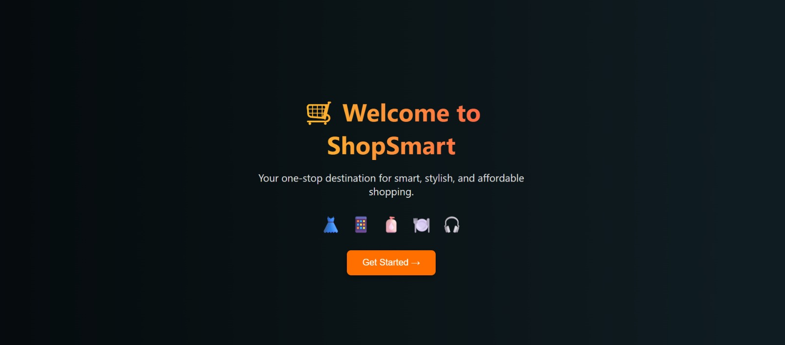

# 🛍️ Shopping Cart Full Stack Application

This is a full-stack shopping cart web application built with:

- **Frontend**: React.js (with Toastify for UI notifications)
- **Backend**: Go (Gin framework) + PostgreSQL (via GORM)
- **Authentication**: JWT-based token authentication
- **Functionality**: User Registration, Login, Item Listing, Add to Cart, Checkout, Order History

---

## 🚀 Features

- 🔐 JWT-based user login/signup
- 🛍 View product catalog
- ➕ Add items to cart
- ✅ Checkout cart
- 📦 View past orders
- 🎨 Responsive UI with Toast notifications
- 💾 Token stored in `localStorage` for session persistence

---

## 🔧 Technologies Used

| Frontend        | Backend        | Database     |
|----------------|----------------|--------------|
| React.js        | Go (Gin)       | PostgreSQL   |
| Axios           | GORM ORM       |              |
| React Toastify  | JWT Auth       |              |

---

## 🛠️ Setup Instructions

### ✅ 1. Clone Repository

git clone https://github.com/arul4902/shopping-cart-fullstack.git

cd shopping-cart-fullstack

### ✅ 2. Backend Setup (Go)
cd shopping-cart-backend

# Initialize Go modules (if not already)
go mod tidy

# Run backend server
go run main.go

Ensure PostgreSQL is running and properly configured in your database.Connect() logic.

### ✅ 3. Frontend Setup (React)
cd shopping-cart-frontend

# Install dependencies
npm install

# Start the frontend
npm start

This will run the React app on http://localhost:3000

## 📸 Screenshots

### Landing Page

### Login Page

### Register Page

### Items Page

### Add to Cart

### View Cart

### Orders Page

### Order History

### Logout

### 🧪 Testing Accounts
You can register any new user and use it to log in. No seeded data required.

### 👨‍💻 Developed By
Arul S

