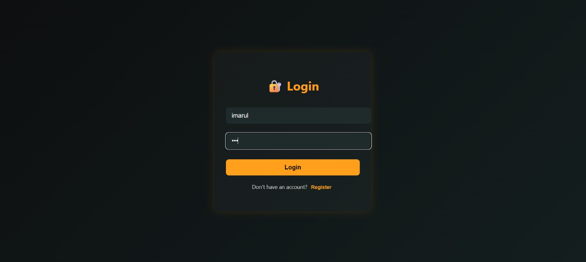
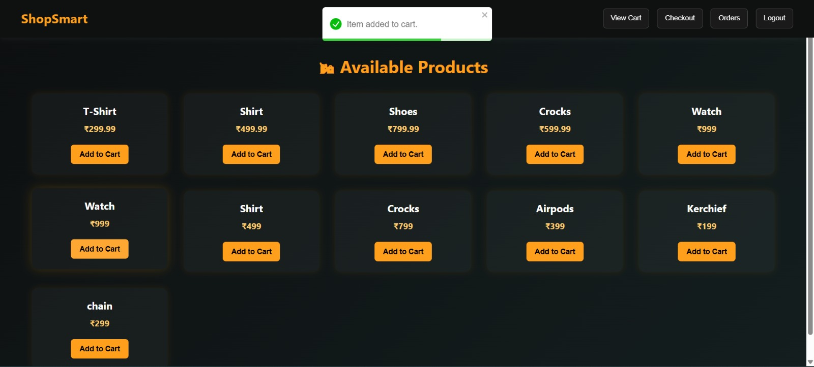
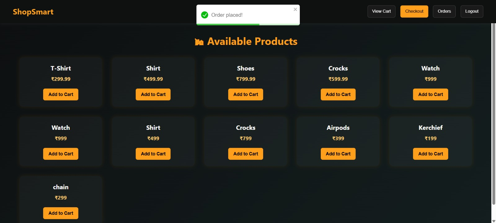
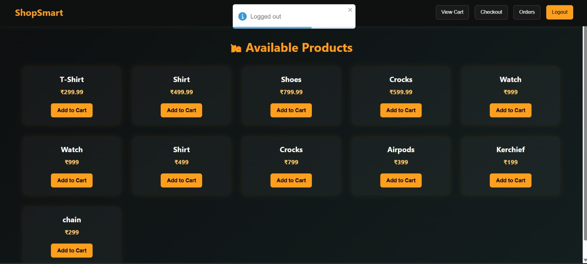

# 🏍️ Shopping Cart – Full Stack Web Application

A responsive, user-friendly full-stack shopping cart web application that enables users to register, log in, view items, add products to cart, check out, and view their order history.

---

## 🔧 Tech Stack

| Frontend | Backend  | Database   | Authentication |
| -------- | -------- | ---------- | -------------- |
| React.js | Go (Gin) | PostgreSQL | JWT Token      |
| Axios    | GORM ORM |            |                |
| Toastify |          |            |                |

---

## 🚀 Features

* 🔐 Secure user authentication using JWT
* 📝 User Registration & Login
* 💼 Browse item catalog
* ➕ Add items to cart
* ✅ Checkout and place orders
* 📦 View order history
* 🌈 Elegant and animated UI (Toast notifications & transitions)
* 💾 Token-based session storage with `localStorage`
* 📱 Fully responsive design

---

## 📁 Project Structure

```
shopping-cart-fullstack/
│
├── shopping-cart-frontend/   → React frontend (Login, Register, Items)
├── shopping-cart-backend/    → Go backend (Gin + GORM + JWT + PostgreSQL)
└── README.md
```

---

## 🛠️ Setup & Run Instructions

### ✅ Step 1: Clone Repository

```bash
git clone https://github.com/arul4902/shopping-cart-fullstack.git
cd shopping-cart-fullstack
```

---

### ✅ Step 2: Backend Setup (Go + PostgreSQL)

```bash
cd shopping-cart-backend
go mod tidy         # Download Go dependencies
go run main.go      # Start backend server
```

> ⚠️ Make sure PostgreSQL is installed and running on port `5432`.
> Update `database.Connect()` with your DB credentials if needed.

---

### ✅ Step 3: Frontend Setup (React)

```bash
cd shopping-cart-frontend
npm install         # Install dependencies
npm start           # Start frontend server at http://localhost:3000
```

---

## 📸 Screenshots

> 🔎 Visual overview of the UI

### 🏠 Landing Page


### 🔐 Login



### 📝 Register


### 💼 Items Catalog


### ➕ Add to Cart



### 🩺 View Cart


### ✅ Checkout & 📦 Orders



### 🔚 Logout



---

## 🧪 Testing

You can register any new account and test the entire workflow:

* Registration → Login → Item Listing → Cart → Checkout → Orders

> No pre-seeded data required.

---

## 🧫 Key Concepts Implemented

* Protected routes using JWT middleware
* RESTful API architecture
* State management via React hooks
* Toast feedback for all user interactions
* Secure backend with token validation

---

## 👨‍💼 Developed By

**Arul S**
*B.Tech (Information Technology), Class of 2026*
GitHub: [arul4902](https://github.com/arul4902)

---
